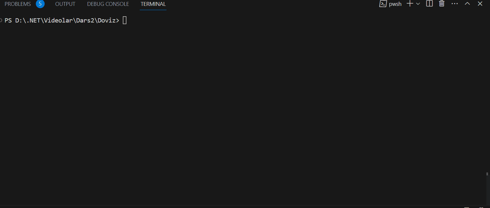

# Doviz v2.0
Your Ultimate Conversion tool

This is an improved version **[v1.0](https://github.com/Jarus95/Doviz/tree/releases/v1.0)**

Have a look at `Program.cs` file and you can see how I have used:

* Console input/output
* Logical operations (Switch case)
* Arithmetic operation 
* Loop operation

## Demo

## Release Notes

### **[v2.0](https://github.com/Jarus95/Doviz/tree/releases/v2.0)**

#### New Features
* You can convert from UZS to USD
* Program to ask you to try again

### **[v1.0](https://github.com/Jarus95/Doviz/tree/releases/v1.0)**

#### Features
* You can convert Money from Usd to UZS

## How to run locally
1. Press the green clone button and copy the git **[link](https://github.com/Jarus95/Doviz.git)**

2. Open your local folder and run terminal then enter the command *git clone **[link](https://github.com/Jarus95/Doviz.git)***

3. Open project and write _dotnet run_ command in terminal

